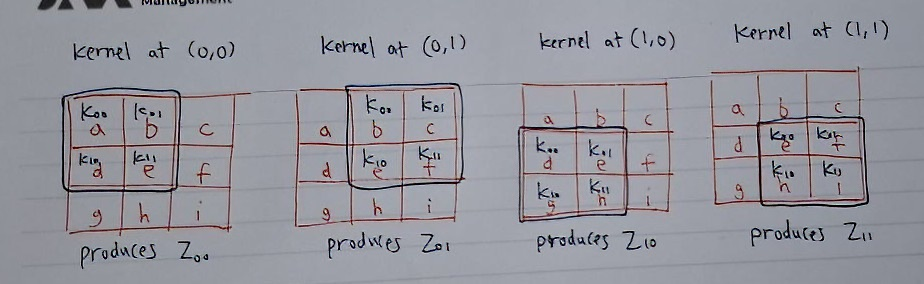
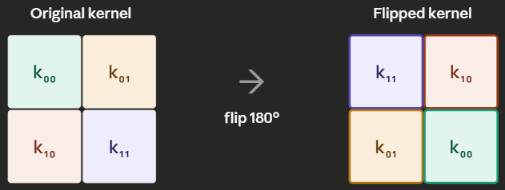
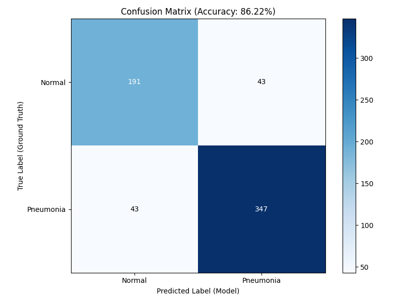
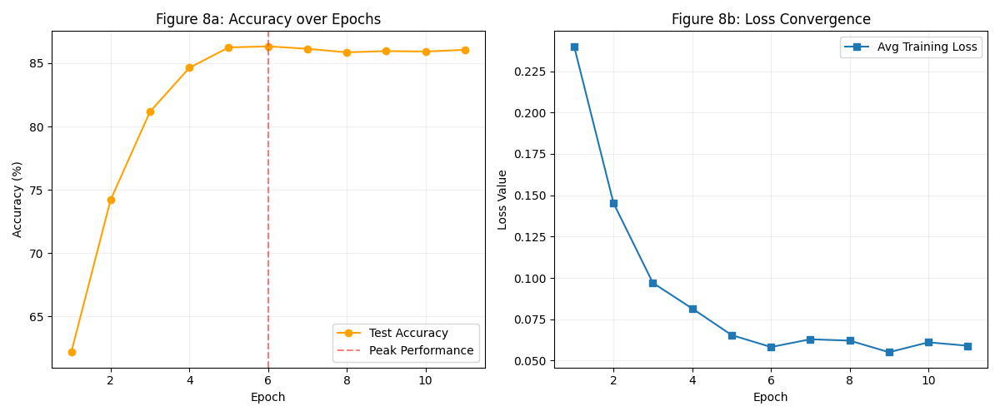

# Convolutional Neural Network From Scratch (Pneumonia)

## 1. Introduction
This project focuses on building a Convolutional Neural Network (CNN) framework from scratch using only Python and NumPy. While standard neural networks are good for simple tasks, they struggle with images because they treat every pixel as an independent piece of data. This project aims to show how a CNN preserves the spatial structure of an image, showing how it understands how pixels relate to their neighbors and how it identify patterns like pneumonia in chest X-rays.

By building the system manually without libraries like TensorFlow or PyTorch, the project highlights the actual math behind how a computer "sees." Instead of relying on pre-built functions, every step from the sliding window of a convolution to the way error signals travel backward is coded from scratch. This approach ensures a complete understanding of the learning process rather than just treating the model as a black box.

### 1.1 Moving from Pixels to Patterns
In a basic neural network, images are flattened into a single line of numbers, which destroys the "shape" of the data. A CNN is designed specifically to handle 2D data by using filters. The main ideas behind this architecture include:

* **Local Receptive Fields:** Each part of the network only focuses on a small section of the image at a time, similar to how a human eye scans a page.

* **Weight Sharing:** The same filter is used across the entire image to look for specific features. This makes the model much more efficient and easier to train on a CPU.

* **Spatial Awareness:** The network can recognize a feature (like a specific lung texture) regardless of where it appears in the frame.

### 1.2 Medical Application: Pneumonia Detection
Medical images are often noisy and the differences between "Normal" and "Pneumonia" can be very subtle. A key part of this project is not just getting a high accuracy score, but making sure the network is reliable. In a medical setting, missing a sick patient is a much bigger error than a false alarm. Therefore, the project explores how to adjust the training process to prioritize finding every positive case.

## 2. System Architecture
A Convolutional Neural Network (CNN) is structured as a series of specialized layers that process data in a "spatial" way. Unlike standard networks that see an image as a flat list, a CNN treats it as a 3D volume with height, width, and depth. The architecture is designed to act as a funnel, taking a high-resolution input and gradually condensing it into high-level features that represent the objects or patterns within the image.

### 2.1 Input and Initial Processing
The architecture begins with the Input Layer, which stores the raw pixel data. In a CNN, this is usually represented as a 3D tensor where the dimensions correspond to the height, width, and the number of color channels (such as 1 for grayscale or 3 for RGB). Because the network needs to maintain the geometric relationship between pixels, this layer does not flatten the data. Instead, it preserves the grid structure so that the following layers can look for patterns in specific areas of the image.

### 2.2 Feature Extraction through Convolutional Layers
The Convolutional Layer is the primary engine of the network. It uses a set of learnable filters, also known as kernels, which are small matrices that slide across the input data. At every position, the filter performs a mathematical operation to see how well its own pattern matches the pixels in that specific spot. This process, illustrated in Fig. 1, allows the network to create "feature maps" that highlight where certain shapes, like edges or textures, are located. Because the same filter is used for the entire image, the network can recognize a pattern no matter where it appears, which makes it much more efficient than a standard fully connected layer.

### 2.3 Dimensionality Reduction via Pooling
To prevent the network from becoming too computationally heavy and to make it more reliable, Pooling Layers are placed between convolutional stages. These layers serve to "downsample" the feature maps, effectively shrinking the height and width of the data. Max-Pooling is the most common version, where the layer looks at a small window of pixels and only passes the highest value to the next stage, as demonstrated in Fig. 2. This ignores the exact location of a feature in favor of its general presence, which helps the network handle images where the subject might be slightly tilted or shifted.

### 2.4 The Fully Connected Head and Classification
Once the convolutional and pooling layers have extracted the most important visual information, the data must be converted into a format that can be used for a final decision. The 3D feature maps are "flattened" into a 1D vector and passed into a Fully Connected Layer. This part of the network acts like a standard classifier, looking at the entire collection of detected features to determine which category the image belongs to. In a binary system, a single output neuron with an activation function like Sigmoid is used to calculate the final probability of the target class.

<div align="center">
    
    <p align="center"><strong>Fig. 1.</strong> Complete CNN architecture showing the transition from 3D feature maps to a flattened 1D vector for classification. [1]<p>
</div>

## 3. Forward Propagation
Forward propagation is the mathematical process where input data travels through the network to generate a prediction. In a Convolutional Neural Network, this involves moving from a high-resolution raw image to a set of abstract features, and finally to a probability. Instead of processing the entire image at once, the forward pass breaks the image down into local patterns, applying linear transformations and non-linear activations at each stage. This sequential flow ensures that the model can build a complex understanding of the chest X-ray, starting with simple edges and ending with diagnostic indicators.

### 3.1 The Convolutional Operation and Feature Extraction
The core of the forward pass begins with the convolutional operation. As a filter slides across the input image, it performs a element-wise multiplication and summation, also known technically as a cross-correlation. For each position $(i, j)$ in the output map, the operation is calculated as:

$$z_{i,j} = \sum_{m} \sum_{n} I_{i+m, j+n} \cdot K_{m,n} + b$$

To understand how the computer actually processes the image, the terms can be broken down as follows:

**The Input Image and the Kernel Weights ($I_{i+m, j+n} \cdot K_{m,n}$):** At each position $(i, j)$, a $3 \times 3$ window slides across the input image $I$, capturing a patch of pixel values $I_{i+m,j+n}$. Each pixel in this patch is multiplied by a corresponding weight $K_{m,n}$ from the kernel, which is a small $3 \times 3$ grid of learned values that determines which patterns the filter responds to. The double summation $\sum_m \sum_n$ then accumulates all nine products across the rows ($m$) and columns ($n$) of the kernel into a single scalar $z_{i,j}$.

<div align="center">
    
    <p align="center"><strong>Fig. 2.</strong> The kernel slides across the input image, multiplying each pixel in the 3×3 patch by its corresponding weight​. The nine products are summed and a bias is added, producing one value in the feature map. Here, the products sum to 1 and a bias of −2 yields a final activation of −1. [2]<p>
</div>

**The Bias ($b$):** A learned scalar constant $b$ is added to the weighted sum. This shifts the activation threshold, allowing the network to adjust how sensitive a filter is to a given feature independently of the input pixel values. In Fig. 2, a bias of $b = -2$ is added to the sum of $1$, yielding a final activation of $z_{i,j} = -1$.

### 3.2 Non-Linearity through ReLU
Once the feature maps are generated, they are passed through a Rectified Linear Unit (ReLU) activation function. The primary purpose of this step is to introduce non-linearity, which allows the network to learn relationships that aren't just simple linear combinations of pixels. The ReLU function is defined as $f(z) = \max(0, z)$, meaning it allows positive signals to pass through unchanged while effectively "turning off" any negative values. This helps the network focus on the most relevant features and prevents the mathematical instability that can occur in deeper networks.

<div align="center">
    
    <p align="center"><strong>Fig. 3.</strong> Feature map passing through ReLU activation function. [2]<p>
</div>

### 3.3 Spatial Downsampling with Max Pooling
Following activation, the feature maps undergo Max Pooling to reduce their spatial dimensions. The network slides a $2 \times 2$ window across the feature map and selects only the maximum value within that window to move forward to the next layer. This operation is critical for maintaining "translation invariance," which means the network can still recognize a pattern even if it is shifted slightly in the image. Furthermore, by shrinking the height and width of the data by half, the pooling step significantly reduces the computational load for the subsequent layers without losing the most prominent features.

<div align="center">
    
    <p align="center"><strong>Fig. 4.</strong> Max pooling: each 2×2 region collapses to its single highest value, halving the map size. [2]<p>
</div>

### 3.4 Flattening and the Sigmoid Prediction
The final stage of the forward pass involves converting the 3D feature volumes into a 1D vector through a process called flattening. This vector is then passed to a single output neuron in a fully connected layer. To convert the raw signal into a usable diagnosis, the network applies the Sigmoid activation function:

$$\sigma(z) = \frac{1}{1 + e^{-z}}$$

This function maps any input value into a strict range between 0 and 1, which represents the probability of the presence of pneumonia. A value closer to 1 indicate the network is confident in a positive diagnosis, while a value closer to 0 indicates a healthy scan.

## 4. Loss Function
The loss function is the mathematical tool the network uses to measure the gap between its predictions and the actual truth. It provides a single scalar value that represents the total error of the model for a given set of images. The objective of the entire training process is to minimize this number through optimization. In a classification task like pneumonia detection, the loss function does not just look at whether the network was right or wrong, but also evaluates how confident it was in its answer, punishing confident but incorrect predictions more severely.

### 4.1 Binary Cross-Entropy (BCE)
For binary classification, the network utilizes the Binary Cross-Entropy loss function. This function is specifically designed to work with the Sigmoid output from the final layer, which provides a probability between 0 and 1. The BCE function compares this probability to the actual label, where 0 represents a healthy scan and 1 represents a pneumonia scan. If the network predicts a high probability for a positive case and the label is actually positive, the loss is low. However, if the network is very confident about the wrong answer (for example, predicting a $0.99$ probability for pneumonia when the patient is actually healthy) the BCE function produces an extremely high loss value. This high error signal is what triggers significant adjustments to the weights during backpropagation.The mathematical formula for the loss is calculated as:

$$
L = -[y \log(\hat{y}) + (1 - y) \log(1 - \hat{y})]
$$

* **$y$ (The True Label):** This is the ground truth, which is either 0 or 1.
* **$\hat{y}$ (The Prediction):** This is the probability output by the Sigmoid function.
* $\log(\hat{y})$: The logarithm ensures that as the prediction gets further from the truth, the loss increases exponentially.

To understand why the formula looks like $L = -[y \log(\hat{y}) + (1 - y) \log(1 - \hat{y})]$, we have to look at the two possible scenarios for a patient:

* **Scenario 1: The Positive Case ($y = 1$):**  
When the chest X-ray contains pneumonia, the second term $(1 - y)$ becomes zero since $(1-1) = 0$, leaving only $L = -\log(\hat{y})$. The network is now solely focused on how close the prediction $\hat{y}$ is to $1$.

* **Scenario 2: The Negative Case ($y = 0$):**  
When the scan is healthy, the first term $y$ becomes zero since $0 \log(\hat{y}) = 0$, leaving $L = -\log(1 - \hat{y})$. The network now only evaluates how close the prediction is to $0$.

### 4.2 Handling Class Imbalance and Medical Priority
A significant challenge in medical imaging is that datasets are often imbalanced, frequently containing far more healthy scans than pneumonia scans. If the loss function treats every error the same, the model might learn to simply guess "healthy" every time to keep the total error low, which is dangerous in a clinical setting. To prevent this, a weighted version of the loss function can be implemented. By adding a penalty multiplier to the pneumonia class, the network is punished more for a False Negative (missing a sick patient) than for a False Positive (a false alarm).

The standard BCE formula is modified by introducing a weight factor, $w_{pos}$, to the positive $(y=1)$ term:

$$
L = -[w_{pos} \cdot y \log(\hat{y}) + (1 - y) \log(1 - \hat{y})]
$$

In a hospital, a "False Alarm" results in an unnecessary follow-up test, but a "Missed Case" results in a patient sent home without treatment. If we set $w_{pos} = 5$, the "pain" or error signal sent to the network is five times stronger when it fails to identify a pneumonia scan. This forces the optimization process to prioritize the minority class, ensuring the model's "knowledge" is biased toward safety and detection.

## 5. Backpropagation
Backpropagation is the process by which the network learns from the error calculated by the loss function. It works by traveling backward from the output layer to the first convolutional layer, using the chain rule to determine how much each individual weight and filter contributed to the final error. In a CNN, this is more complex than a standard dense network because the error must pass through the pooling and activation layers before reaching the convolutional weights. By calculating these gradients, the network determines the precise adjustment required for each parameter before the next training iteration begins.

### 5.1 The Chain Rule and Gradient Flow
To calculate how a specific weight $(w)$ should be adjusted, the network uses the Chain Rule. This mathematical principle allows us to decompose a complex relationship into a series of smaller, local derivatives. For a weight in the dense output layer, the gradient is:

$$
\frac{\partial L}{\partial w} = \frac{\partial L}{\partial \hat{y}} \cdot \frac{\partial \hat{y}}{\partial z} \cdot \frac{\partial z}{\partial w}
$$

If we treat these derivatives like fractions, the intermediate terms ($\partial \hat{y}$ and $\partial z$) effectively cancel out, leaving us with the direct relationship between the Loss and the Weight ($\frac{\partial L}{\partial w}$). In practical terms, this means:

* $x_i$​: The input value arriving at the dense layer from the previous layer (a flattened feature map value).
* $w_i$: The specific weight in the dense layer connecting input $x_i$​ to the output.
* $z$: The raw weighted sum produced by the dense layer, calculated as $z = \sum_{i} w_i \cdot x_i + b$ where each weight $w_i$ is multiplied by its corresponding input $x_i$ and summed together with a bias $b$.
* $\hat{y}$: The final predicted probability, obtained by passing $z$ through the Sigmoid activation function.
* $\frac{\partial L}{\partial \hat{y}}$ **The Error Signal:** How much the loss changes as the prediction changes (the error signal)
* $\frac{\partial \hat{y}}{\partial z}$ **The Activation Slope (Sigmoid Derivative):** How much the prediction changes as the raw sum changes.
* $\frac{\partial z}{\partial w}$ **The Input Contribution:** How much the raw sum changes as the weight changes (the input contribution).

### 5.2 The Initial Error Signal: Weighted BCE Loss
The process starts here. We calculate the gradient of the loss with respect to the final prediction ($\frac{\partial L}{\partial \hat{y}}$). This is the "primary signal" that tells us how far off the model was.

$$
\frac{\partial L}{\partial \hat{y}} = \begin{cases} -\frac{w_{pos}}{\hat{y}} & \text{if } y = 1 \\ \frac{1}{1 - \hat{y}} & \text{if } y = 0 \end{cases}
$$

### 5.3 The Output Activation (Sigmoid Gradient)
Once we have the loss gradient, it must pass through the Sigmoid activation function to reach the raw scores ($z$). We use the Chain Rule to multiply the loss gradient by the sigmoid derivative:

$$
\text{Activation Gradient} = \frac{\partial L}{\partial \hat{y}} \cdot \frac{\partial \hat{y}}{\partial z}
$$

The sigmoid gradient is given by the formula:

$$
\frac{\partial \hat{y}}{\partial z} = \hat{y} \cdot (1 - \hat{y})
$$

Here, $\hat{y}$ is the output of the sigmoid function, $\hat{y} = \frac{1}{1 + e^{-z}}$, and $z$ is the input to the sigmoid function.


### 5.4 Gradient of the Logit with Respect to Weights 

In a dense layer, the logit $z$ is calculated as:
$$
z = \sum_{i} w_i \cdot x_i + b
$$

The gradient of $z$ with respect to a specific weight $w$ is:
$$
\frac{\partial z}{\partial w} = x
$$

Here, $x$ is the input value connected to the weight $w$. This relationship is used during backpropagation to adjust the weights based on the gradient of the loss.

### 5.5 Full Gradient Formula

To calculate the gradient of the loss with respect to a weight $w$, we combine all the components derived earlier. The full formula is:

$$
\frac{\partial L}{\partial w} = \frac{\partial L}{\partial \hat{y}} \cdot \frac{\partial \hat{y}}{\partial z} \cdot \frac{\partial z}{\partial w}
$$

Expanding each term:

1. **Loss Gradient with Respect to Prediction ($\frac{\partial L}{\partial \hat{y}}$):**
   $$
   \frac{\partial L}{\partial \hat{y}} = \begin{cases} 
   -\frac{w_{pos}}{\hat{y}} & \text{if } y = 1 \\
   \frac{1}{1 - \hat{y}} & \text{if } y = 0
   \end{cases}
   $$

2. **Sigmoid Gradient ($\frac{\partial \hat{y}}{\partial z}$):**
   $$
   \frac{\partial \hat{y}}{\partial z} = \hat{y} \cdot (1 - \hat{y})
   $$

3. **Logit Gradient with Respect to Weight ($\frac{\partial z}{\partial w}$):**
   $$
   \frac{\partial z}{\partial w} = x
   $$

Combining these, the full gradient becomes:

$$
\frac{\partial L}{\partial w} = \begin{cases} 
-\frac{w_{pos}}{\hat{y}} \cdot \hat{y} \cdot (1 - \hat{y}) \cdot x & \text{if } y = 1 \\
\frac{1}{1 - \hat{y}} \cdot \hat{y} \cdot (1 - \hat{y}) \cdot x & \text{if } y = 0
\end{cases}
$$

This formula captures the complete gradient calculation for updating a weight $w$ during backpropagation.

### 5.6 Backpropagating through Pooling and ReLU
When the error signal reaches a Max Pooling layer, it encounters a unique challenge: pooling layers do not have weights. Their only job during the forward pass was to select the maximum value from each $2 \times 2$ window. Because there are no weights to adjust, the layer's role in backpropagation is simply to route the error signal back to the correct location. During the forward pass, the network records an argmax mask (a temporary record of which position in each $2 \times 2$ window produced the maximum value). When the error signal travels backward, it is routed exclusively to that position. The three other pixels in each window were discarded during the forward pass and therefore had no influence on the final prediction, so they receive a gradient of zero. The gradient of the loss with respect to the input of the pooling layer $A$ is defined by the following piecewise function:

$$
\frac{\partial L}{\partial A_{i,j}} = \begin{cases} \frac{\partial L}{\partial O_{i,j}} & \text{if } A_{i,j} = \max(\text{window}) \\
0 & \text{otherwise} \end{cases}
$$

Where:  
* $\frac{\partial L}{\partial O_{i,j}}$: The incoming error signal from the next layer (the gradient with respect to the output of the pooling layer).
* $A_{i,j}$: The individual pixel in the input feature map arriving at the pooling layer.
* $\text{max}(window)$: The specific pixel that was selected as the maximum during the forward pass.

Example Argmax mask:

$$
\text{Input} = \begin{bmatrix} 
9 & 3 & 1 & 8 \\ 
2 & 6 & 5 & 3 \\ 
8 & 4 & 2 & 6 \\ 
1 & 7 & 9 & 4 
\end{bmatrix} \quad
\text{Argmax mask} = \begin{bmatrix} 
1 & 0 & 0 & 1 \\ 
0 & 0 & 0 & 0 \\ 
1 & 0 & 0 & 0 \\ 
0 & 0 & 1 & 0 
\end{bmatrix}
$$

Once the gradient has been routed through the pooling layer, it must pass through the ReLU activation before reaching the convolutional layer. ReLU backpropagation follows a straightforward rule: the gradient is passed through unchanged at positions where the forward pass activation was positive, and set to zero at positions where it was negative. This is expressed as:

$$
\frac{\partial L}{\partial z_{i,j}} = \begin{cases} \frac{\partial L}{\partial A_{i,j}} & \text{if } z_{i,j} > 0 \\
0 & \text{otherwise} \end{cases}
$$

Where:

* $\frac{\partial L}{\partial A_{i,j}}$​: The incoming error signal from the pooling layer, as computed above.
* $z_{i,j}$​: The raw pre-activation value at position $(i,j)$, computed during the forward pass.

It is this value, $\frac{\partial L}{\partial z_{i,j}}$, that is passed back into section 5.3 as the incoming error signal for computing the convolutional gradients.

### 5.7 Convolutional Gradients (Updating the Kernels)
The most critical part of the learning process is updating the convolutional filters ($K$). Unlike a standard dense layer where a weight is only responsible for one connection, a convolutional weight is reused across the entire image. Therefore, its gradient must be the sum of its contribution at every position it visited during the forward pass. To find the gradient for a specific weight within a $3 \times 3$ kernel, we use a double summation to accumulate error across the entire height and width of the feature map. Mathematically, the gradient for a kernel weight at position $(m, n)$ is:

$$
\frac{\partial L}{\partial K_{m,n}} = \sum_{i=0}^{H-1} \sum_{j=0}^{W-1} \frac{\partial L}{\partial Z_{i,j}} \cdot I_{i+m, j+n}
$$

Where:
* $\frac{\partial L}{\partial K_{m,n}}$: The total gradient for one specific weight in the $3\times3$ kernel, accumulated across every position in the feature map.
* $\sum_{i=0}^{H-1} \sum_{j=0}^{W-1}$: The spatial summations, which iterate over every row $(i)$ and column $(j)$ of the output feature map.
* $\frac{\partial L}{\partial Z_{i,j}}$: The feature map error at a specific coordinate, computed in section 5.4. It represents how much the network's output at that exact position contributed to the overall loss.
* $I_{i+m, j+n}$: The input pixel that the kernel weight was reading during the forward pass. By using the indices $i+m$ and $j+n$, we align the error with the exact patch of the image that created it.

This formula takes two things that are already known at this stage of backpropagation: the error at every position in the feature map $\frac{\partial L}{\partial z_{i,j}}$​, computed in section 5.4, and the original input image pixel values $I_{i+m,j+n}$​. By multiplying them together at every position and summing the result, we obtain the total gradient for each kernel weight. Critically, $\frac{\partial L}{\partial z_{i,j}}$ is spent twice at this layer: once here to update the kernel weights, and once in section 5.6 to pass the error signal further backwards. This is true at every convolutional layer in the network.

After the double summation is completed for all 9 weights in the kernel, we obtain a $3 \times 3$ gradient matrix, $\frac{\partial L}{\partial K}$, where each cell corresponds to the gradient of one specific weight in the kernel. This is shorthand for 9 simultaneous independent updates, one per kernel weight. For each position $(m,n)$, the update is:

$$
K_{m,n}^{\text{new}} = K_{m,n}^{\text{old}} - \eta \cdot \frac{\partial L}{\partial K_{m,n}}
$$

Written compactly for all 9 weights simultaneously:

$$
K_{\text{new}} = K_{\text{old}} - \eta \cdot \frac{\partial L}{\partial K}
$$

Each weight is adjusted independently by its own gradient. A weight that contributed heavily to the loss receives a large update, while a weight that had little influence receives a small one.

### 5.8 Passing Error to Previous Feature Maps
Once the kernel weights have been updated, $\frac{\partial L}{\partial z_{i,j}}$​ is spent for the second time now to compute how much error each input pixel in the current layer's input feature map contributed to the loss. This is necessary so that any earlier convolutional layers have an error signal to backpropagate through in turn.

To understand why this requires a flipped kernel, consider what happened during the forward pass. As the kernel slid across the input, each input pixel was touched by a different kernel weight depending on the kernel's position. Taking pixel $e$ as an example:

$$\begin{aligned}
\text{Kernel at } (0,0): & \quad e \cdot K_{1,1} \rightarrow z_{0,0} \\
\text{Kernel at } (0,1): & \quad e \cdot K_{1,0} \rightarrow z_{0,1} \\
\text{Kernel at } (1,0): & \quad e \cdot K_{0,1} \rightarrow z_{1,0} \\
\text{Kernel at } (1,1): & \quad e \cdot K_{0,0} \rightarrow z_{1,1}
\end{aligned}$$

<div align="center">
    
    <p align="center"><strong>Fig. 5.</strong> As the 2×2 kernel slides to each of the four valid positions over the 3×3 input, pixel e (centre) is covered by a different kernel weight at each position. During backpropagation, the error at each output must therefore flow back to pixel e through the exact kernel weight that originally produced it. <p>
</div>

The total error flowing back to pixel $e$ is therefore calculated by summing the gradients from each output $z_{i,j}$ that $e$ contributed to, weighted by their respective kernel weights:


$$\frac{\partial L}{\partial e} = \frac{\partial L}{\partial z_{0,0}} K_{1,1} + \frac{\partial L}{\partial z_{0,1}} K_{1,0} + \frac{\partial L}{\partial z_{1,0}} K_{0,1} + \frac{\partial L}{\partial z_{1,1}} K_{0,0}$$

Notice that the kernel weights in this sum appear in reverse order: $K_{1,1}, K_{1,0}, K_{0,1}, K_{0,0}$, which is the original kernel read backwards. This reverse ordering arises directly from the forward pass: as the kernel slid from position $(0,0)$ to $(1,1)$ over pixel $e$, the weight directly above $e$ progressed from $K_{1,1}$ down to $K_{0,0}$, the opposite direction to the kernel's travel. This has an important consequence for backpropagation. If we naively convolved the error map with the original kernel, each output error would be paired with the wrong weight:

$$
\frac{\partial L}{\partial e}_{\text{wrong}} = \frac{\partial L}{\partial z_{0,0}} \times K_{0,0} + \frac{\partial L}{\partial z_{0,1}} \times K_{0,1} + \frac{\partial L}{\partial z_{1,0}} \times K_{1,0} + \frac{\partial L}{\partial z_{1,1}} \times K_{1,1}
$$

Flipping the kernel 180°, which is equivalent to reversing it both horizontally and vertically, corrects this misalignment automatically, producing the correct weight-error pairings for every input pixel simultaneously without manually tracking each connection. The general formula for the gradient with respect to the input feature map is:

$$
\frac{\partial L}{\partial I_{i,j}} = \sum_{m} \sum_{n} \frac{\partial L}{\partial z_{i-m, j-n}} \cdot K_{m,n}
$$

where the shifted indices $(i-m, j-n)$ are the mathematical expression of the kernel flip. The resulting gradient map $\frac{\partial L}{\partial I}$ then becomes the incoming error signal for the previous layer, where the same two-step process (update weights, pass error backwards) repeats again, all the way back to the first convolutional layer.

<div align="center">
    
    <p align="center"><strong>Fig. 6. </strong>Flipping the kernel 180° reverses the order of the weights, which is mathematically equivalent to changing the convolution indices from +(m, n) to -(m, n).<p>
</div>

## 6. Training & Optimization
The training process is a continuous loop of predicting, measuring error, and adjusting. While sections 3 through 5 described how a single forward and backward pass works for one image, optimization is what allows the network to learn from an entire dataset of thousands of X-rays. This section explains how the gradients computed in section 5 are applied in practice to update every learnable parameter in the network.

### 6.1 The Stochastic Gradient Descent (SGD) Loop
The network learns through a process called Stochastic Gradient Descent (SGD). Instead of processing the entire dataset at once, the model processes one small batch of images at a time. For each batch, it performs a forward pass to obtain a prediction, computes the loss using the Binary Cross-Entropy function from section 4.1, and then performs a backward pass to compute the gradients for every learnable parameter as described in section 5. The weights are then immediately updated using those gradients. By repeating this process thousands of times across the entire dataset, the model progressively reduces the total loss until it reaches the lowest point.

### 6.2 The Learning Rate ($\eta$)
The learning rate $\eta$ is a multiplier applied to every gradient before it is used to update a weight. It controls how large a step the network takes in the direction of the gradient. The general update rule is:

$$
W_{\text{new}} = W_{\text{old}} - \eta \cdot \frac{\partial L}{\partial W}
$$

This rule is applied to every learnable parameter in the network after each backward pass. Concretely, for the CNN described in this paper, this means:

* Every weight in the convolutional kernels: $K_{m,n}^{\text{new}} = K_{m,n}^{\text{old}} - \eta \cdot \frac{\partial L}{\partial K_{m,n}}$

* Every weight in the dense layer: $w_{i}^{\text{new}} = w_{i}^{\text{old}} - \eta \cdot \frac{\partial L}{\partial w_{i}}$

* Every bias term in every layer: $b^{\text{new}} = b^{\text{old}} - \eta \cdot \frac{\partial L}{\partial b}$

If the learning rate is too high, the network may overshoot the optimal weights and fail to converge. If it is too low, the network will require a large number of epochs to reach an acceptable level of accuracy. Selecting an appropriate learning rate is therefore critical to ensuring the model converges efficiently.

### 6.3 Epochs and Convergence
Training is measured in epochs, where one epoch represents the network processing every image in the training dataset exactly once. Because the network only adjusts its weights by a small amount per batch, multiple epochs are required for the network to fully learn the features of a medical scan. As training progresses, the total loss should steadily decrease while the validation accuracy increases. When the loss plateaus and stops decreasing, the model has reached convergence.

## 7. Dataset and Preprocessing
Before any training can begin, the raw chest X-ray images must be cleaned and standardized. In a medical dataset, images often come in different sizes, brightness levels, and file formats. Preprocessing ensures that the neural network receives a consistent input, which helps the mathematical gradients remain stable and prevents the model from responding to irrelevant artefacts such as the outer border of a scan.

### 7.1 Resizing and Grayscale Conversion
Medical X-rays are typically very high resolution, often thousands of pixels wide. Processing these directly on a CPU would be computationally prohibitive and would likely exhaust the system's memory. To address this, all images are resized to a uniform $64 \times 64$ resolution. While this reduction in resolution sacrifices some fine-grained detail, this size is sufficient to preserve the primary patterns associated with pneumonia while remaining small enough for a CNN to process efficiently. This is an explicit trade-off between computational feasibility and diagnostic detail.

Additionally, since color does not exist in X-rays, any images with multiple color channels are converted to a single grayscale channel using the standard luminance formula:

$$
I_{\text{gray}} = 0.299 \cdot R + 0.587 \cdot G + 0.114 \cdot B
$$

where $R$, $G$, and $B$ are the red, green, and blue channel values respectively. The green channel is weighted most heavily because the human visual system is most sensitive to green wavelengths. This conversion reduces the total volume of data the network must process without discarding any clinically relevant information, since X-ray images carry no diagnostic information in color.

### 7.2 Pixel Normalization
Raw pixel values typically range from 0 (black) to 255 (white). If these large values are fed directly into the network, they can cause the gradients to grow unstably large during backpropagation (exploding gradients). To prevent this, every pixel is divided by 255 following the normalization formula:

$$
I_{\text{normalized}} = \frac{I_{\text{raw}}}{255}
$$

This scales every pixel value into the range:

$$
I_{\text{normalized}} \in [0, 1]
$$

This normalization step ensures that the input values are small and bounded, which allows the activation functions (such as ReLU and Sigmoid) to operate reliably and the gradients to remain numerically stable throughout training.

### 7.3 Data Splitting: Training vs. Testing
To truly know if the model is learning or just memorizing, the dataset is split into two distinct groups: the Training Set and the Test Set. The network only ever "sees" the training set during the backpropagation phase. The test set is kept completely hidden until the training is finished. By evaluating the model on these "unseen" images, we can calculate a true accuracy score and ensure that the model can actually diagnose new patients it has never encountered before.

## 8. Implementation
This section details the construction of the CNN framework from scratch.

### 8.1 Data Preprocessing and Augmentation Pipeline
A custom preprocessing pipeline was engineered to transform raw, heterogeneous medical imaging data into a format suitable for a manual, list-based CNN architecture. The raw X-ray dataset, originally composed of JPEG format with inconsistent dimensions and color channels, underwent a streamlined transformation process within `preprocess_data.py`. To minimize computational overhead and ensure the model prioritized patterns over irrelevant color artifacts, every image was converted to an 8-bit grayscale ('L' mode). This 'L-mode' conversion collapsed the input depth to a single channel, which significantly reduced the parameters required for the initial convolutional layer to learn. Following this, the images were resized to a standardized $64 \times 64$ resolution. This size is small enough to keep the training process fast and manageable using standard Python lists, while still preserving enough details needed to spot pneumonia.

Working without high-level tools like PyTorch’s `DataLoader` makes it hard to handle the constant back-and-forth of reading and decoding image files from the disk. To make the training loop more efficient, a "JSON-first" strategy was used instead. The `process_directory` function turns every image into a nested Python list ahead of time so the program doesn't have to decode JPEGs over and over during every epoch.

```python
with Image.open(os.path.join(source_dir, filename)) as img:
    img = img.convert('L')
    
    # 2. Resize to 64x64
    img = img.resize((size, size))
    
    # 3. Convert to a Python List of Lists
    pixels: List[List[int]] = []
    for y in range(size):
        row = [img.getpixel((x, y)) for x in range(size)]
        pixels.append(row)
    
    # 4. Save as JSON
    # rsplt ensures we handle filenames with multiple dots correctly
    json_name = filename.rsplit('.', 1)[0] + ".json"
    with open(os.path.join(target_dir, json_name), 'w') as f:
        json.dump(pixels, f)
```

This approach ensures data integrity because every training sample is turned into an identical $64 \times 64$ grid beforehand. This prevents "shape mismatch" errors that usually happen during the convolution process. It also makes the I/O more efficient since reading a JSON file into a Python list is a native operation. This significantly lowers the extra work the computer has to do for each image during the forward pass.

The final step of the preparation pipeline involves the `load_processed_data` function. This utility maps the directory structure to binary labels:
* `data/processed/train/normal` $\rightarrow$ **Label 0**
* `data/processed/train/pneumonia` $\rightarrow$ **Label 1** 

These labeled pairs are returned as a list of tuples (image_data, label), providing the structured input necessary for the Stochastic Gradient Descent (SGD) loop used in the baseline model.

While the JSON files store raw pixel intensities $(0–255)$, the model requires floating-point inputs for mathematical stability. This transition is handled by the `ImageProcessor` class during the data loading phase. By implementing a $1/255$ normalization transform, the $64 \times 64$ grids are converted into a normalized range of $[0.0, 1.0]$ before entering the first convolutional layer. By keeping input values small, the weighted sums stay within the "active" regions of the Leaky ReLU and Sigmoid functions, ensuring that gradients do not vanish during the very first epoch of training.

```python
for i in range(target_h):
    for j in range(target_w):
        # Map the target coordinate back to the source coordinate
        source_i: int = int(i * row_ratio)
        source_j: int = int(j * col_ratio)
        
        # Pixel Normalization (0-255 -> 0.0-1.0)
        resized[i][j] = image[source_i][source_j] / 255.0
```

### 8.2 The Layer-Based Architecture (Object-Oriented Design)
To manage the complexity of multi-layer feature extraction, the system was built using an Object-Oriented Programming (OOP) approach. Every component follows a strict "Layer" system, implementing custom `forward()` and `backward()` methods to manage signal flow and gradient updates.

**Convolution layers (`convolution.py`)**  
The `ConvolutionLayer` implementation handles 3D feature maps, allowing the network to process multiple channels deep in the stack. To keep the architecture flexible, the layer uses deferred weight initialization, meaning it waits until the first forward pass to check the input depth before it actually sets up the weights. This makes it easier to switch between things like 1-channel images and 16-channel feature maps. To stop the "vanishing gradient" problem where the model stops learning, weights are set using He (Kaiming) initialization. This follows a normal distribution scaled by the "fan-in," or the number of input connections:

$$
W \sim \mathcal{N}\left(0, \sqrt{\frac{2}{\text{fan-in}}}\right)
$$

A "safety factor" of $0.1$ was also added to the scale to make sure the activations don't saturate right at the start. Finally, the 3D scan logic in the forward pass uses a six-layer nested loop to slide the filters across the height, width, and depth of the input.

```python
def _init_filters(self, depth: int):
    he_scale = (2.0 / (self.k * self.k * depth)) ** 0.5
    tuned_scale = he_scale * 0.1

    self.filters = [
        [[[random.gauss(0, tuned_scale) for _ in range(self.k)]  # Dimension 4: kernel row
            for _ in range(self.k)]                              # Dimension 3: kernel column                                               
            for _ in range(depth)]                               # Dimension 2: input channels        
            for _ in range(self.num_filters)                     # Dimension 1: number of filters
    ]
```

Finally, the 3D scan logic in the forward pass uses a six-layer nested loop to slide the filters across the height, width, and depth of the input.

```python
for f in range(self.num_filters):            # Loop over each filter
    for i in range(out_h):                   # Loop over output height
        for j in range(out_w):               # Loop over output width
            summ = 0.0
            for c in range(in_d):            # Loop over input channels
                for m in range(self.k):      # Loop over kernel height
                    for n in range(self.k):  # Loop over kernel width
                        summ += input_data[i + m][j + n][c] * self.filters[f][c][m][n]
            
            output[i][j][f] = summ + self.biases[f]
return output
```

**Max-Pooling (`pooling.py`)**  
The `MaxPoolingLayer` provides spatial downsampling, which shrinks the $64 \times 64$ input into a more manageable feature set. During the forward pass, a $2 \times 2$ window slides across the input with a stride of 2, picking only the maximum intensity value from each section. This process is useful because it helps the model recognize patterns even if there are small shifts or rotations in the X-ray image. Because pooling doesn't have weights, it isn't "trained" like a normal layer, so it uses a method called "Argmax" gradient routing for the backpropagation. During the `backward()` pass, the layer finds the exact coordinate where the maximum value was located during the forward pass and sends the entire gradient to that specific pixel. This effectively tells the model which specific feature was the most important one to focus on.

```python
for f in range(f_count):
    for i in range(out_h):
        for j in range(out_w):

            # Identify the maximum value within the pooling window
            max_val: float = -float('inf')
            for m in range(self.size):
                for n in range(self.size):

                    # Calculate the input coordinate based on stride (i * size)
                    val: float = input_3d[i * self.size + m][j * self.size + n][f]
                    if val > max_val:
                        max_val = val

            # Resulting shape is [row][col][filter] (Channel-Last format)
            output[i][j][f] = max_val
return output
```

```python
for f in range(f_count):
    for i in range(out_h):
        for j in range(out_w):

            # Re-identify the maximum position (Argmax) to route the error
            max_val: float = -float('inf')
            max_pos: Tuple[int, int] = (0, 0)
            
            # Scan the local size x size neighborhood in the cached forward input
            for m in range(self.size):
                for n in range(self.size):

                    # Calculate the absolute input coordinate using the stride (i * size)
                    curr_val: float = self.last_input[i * self.size + m][j * self.size + n][f]
                    if curr_val > max_val:
                        max_val = curr_val

                        # Store the specific row and column of the winner
                        max_pos = (i * self.size + m, j * self.size + n)
            
            # Route the gradient: Only the winner receives the incoming error signal
            d_L_d_input[max_pos[0]][max_pos[1]][f] = d_L_d_out[i][j][f]

return d_L_d_input
```

**Non-Linear Activation Functions (`activations.py`)**  
To allow the model to learn complex, non-linear patterns in lung tissue, two custom activation functions were implemented in `activations.py`. While the initial models experimented with standard ReLU, they frequently encountered the "dead neuron" problem, where large negative gradients would effectively "turn off" parts of the network, halting the learning process. To solve this, the architecture transitioned to Leaky ReLU for all hidden layers. By returning $z$ for positive values and a tiny fraction ($0.01z$) for negative values, the function ensures that a small gradient always exists, allowing the model to continue updating its weights even when inputs are sub-zero.

```python
def relu(z: float) -> float:
    return z if z > 0 else 0.01 * z
```
For the final classification, a Sigmoid function was used to map the network's output to a probability between 0 and 1. A common issue with manual implementations of the Sigmoid is the risk of a "math range error" when the exponent becomes too large. To prevent the program from crashing during high-loss states, a "clamping" mechanism was added to the code. This limits the input value $z$ between -500 and 500, ensuring the `math.exp` function stays within a safe numerical range while still providing the precision needed.

```python
def sigmoid(z: float) -> float:
    z = max(-500, min(500, z))
    return 1 / (1 + math.exp(-z))
```

**Loss Calculation (`loss.py`)**  
A major turning point for the project’s stability was the move from Binary Cross Entropy (BCE) to Huber Loss. In the early models (v1.0 through v4.0), the training process was extremely sensitive. While BCE is the standard for binary classification, its logarithmic nature means that if the model makes a highly confident but incorrect prediction, the resulting gradient can become massive, sometimes approaching infinity. This led to "exploding gradients" that would suddenly over-correct the weights and ruin the progress made in previous epochs. To prevent this, the initial learning rates had extremely low ($0.00001$).

The implementation of Huber Loss in loss.py fixed this by changing how the model reacts to these large errors. The formula acts as a piecewise function that shifts its behavior based on the size of the error ($a = y_{true} - y_{pred}$):

$$
L_{\delta}(a) =\begin{cases}\frac{1}{2}a^2 & \text{for } |a| \le \delta \\delta(|a| - \frac{1}{2}\delta) & \text{otherwise}\end{cases}
$$

By using this logic, the loss function acts like a stable quadratic function for small mistakes (where $|a| \le 1.0$), but for any error larger than the threshold ($\delta = 1.0$), it switches to a linear calculation. This effectively "caps" the gradient, ensuring the model no longer overreacts to outliers or confidently wrong predictions. This shift was the primary reason the learning rate could eventually be increased to $0.0025$ (250x increase) without the network becoming unstable. This allowed the model to converge much faster while staying robust against the natural noise found in medical chest scans.

### 8.3 Incremental Model Evolution and Results
The development of the CNN was an iterative process. Each version was designed to solve a specific problem identified in the previous run, such as exploding gradients, overfitting, or dataset imbalance. The following table summarizes the performance of the six primary iterations:

```
+---------+----------------+--------------------------------+-----------+----------+----------+
| Version | Architecture   | Key Change                     | Train Acc | Test Acc | Avg Loss |
+---------+----------------+--------------------------------+-----------+----------+----------+
| v1.0    | 1-Conv (8 fil) | Baseline Implementation        | 91.99%    | 75.16%   | 2.3745   |
| v2.0    | 1-Conv (8 fil) | L2 Regularization & Shuffling  | 91.07%    | 79.49%   | 3.4004   |
| v3.0    | 1-Conv (8 fil) | High L2 (0.005)- Oversmoothed  | 92.06%    | 67.79%   | 1.1001   |
| v4.0    | 1-Conv (16 fil)| Doubled Filter Capacity        | 91.56%    | 83.65%   | 6.1741   |
| v5.0    | 2-Conv (Deep)  | Huber Loss & 0.0025 LR         | 97.87%    | 80.45%   | 0.0785   |
| v6.0    | 2-Conv (Deep)  | Augmentation & Class Weights   | 92.73%    | 86.22%   | 0.1241   |
+---------+----------------+--------------------------------+-----------+----------+----------+
```

The project began with v1.0, which proved that the manual 3D convolution math was working, but the 16% gap between training and testing showed heavy overfitting. To fix this, v2.0 introduced L2 regularization and data shuffling. Shuffling the JSON files before each epoch was a small change that made a big difference, helping the model discover more general features and boosting test accuracy by over 4%. However, v3.0 showed that too much regularization can be a bad thing; the high L2 penalty likely "oversmoothed" the weights, causing the model to miss the fine details of the X-rays and dropping accuracy significantly. A major breakthrough occurred between v4.0 and v5.0. While doubling the filters in v4.0 helped reach 83% accuracy, the model was still unstable and required a very low learning rate. By switching to a deeper 2-Convolution architecture and replacing the original loss function with Huber Loss, the gradients finally stabilized. This allowed the learning rate to be increased from $0.000008$ to $0.0025$. Even though v5.0 had a very low loss, it started to "memorize" the training data again because the deeper architecture was too powerful for the small dataset. The final version, v6.0, focused on fixing this final bottleneck through data strategy rather than just more layers. By adding horizontal flips and random 2-pixel shifts (Data Augmentation), the model was forced to learn what pneumonia actually looks like regardless of where it appeared in the image. Additionally, a class weight of $2.0$ was applied to the "Normal" images to counteract the 3:1 imbalance in the dataset. These final tweaks successfully closed the overfitting gap and resulted in a peak test accuracy of 86.22%, the highest achieved in the project.

## 9. Evaluation and Results
Following the training of the final model iteration (v6.0 Augmented), the system was evaluated against a held-out test set of 624 images. This test set contains data the model never encountered during training, serving as a benchmark for its ability to generalize to new data.

### 9.1 Confusion Matrix Analysis  
To achieve a comprehensive evaluation of the diagnostic model, a Confusion Matrix was utilized. While standard accuracy provides a high-level view of how often the model is correct, the Confusion Matrix is essential for revealing the specific nature of its predictive errors. By breaking down the results into True Positives, True Negatives, False Positives, and False Negatives, we can determine whether the system is more prone to missing active infections or raising unnecessary false alarms.

<div align="center">
    
    <p align="center"><strong>Fig. 7.</strong>Confusion Matrix for Model v6.0 on Test Dataset (n=624).<p>
</div>

The final evaluation on the test set ($n = 624$) produced a symmetric raw error count of 43 False Positives and 43 False Negatives. However, because the test set is imbalanced (390 Pneumonia images and 234 Normal images), raw numbers alone can be deceptive. It is critical to evaluate the error ratios within each specific class to understand the model's true diagnostic behavior. The model achieved a Recall (True Positive Rate) of 88.97% and a Specificity (True Negative Rate) of 81.62%. When examining the inverse of these figures, the Miss Rate (False Negative Rate) is 11.03%, while the Fall-out (False Positive Rate) is 18.38%. Additionally, the model maintained a Precision (Positive Predictive Value) of 88.97%, resulting in a balanced F1-Score of 0.8897. While the raw error counts are identical, the model is more accurate at identifying Pneumonia than it is at identifying healthy lungs. From a clinical standpoint, this is an intentional and positive outcome. By applying a class weight of $w_{pos} = 2.0$, the model was more cautious about missing infections. The trade-off was a slightly elevated False Positive Rate. However, in a medical screening environment, it is generally considered safer to over-diagnose, which leads to a professional follow-up, than to under-diagnose and potentially send a sick patient home without treatment. Ultimately, the model has not reached a "perfect" mathematical equilibrium, but rather a clinically optimized bias. It successfully prioritizes the detection of the more dangerous condition while maintaining a respectable accuracy of over 81% on healthy scans.

### 9.2 Training Dynamics and Convergence Analysis
To understand the model's learning behavior, the relationship between the optimization of the objective function and the resulting classification accuracy over the 11 epochs is plotted. As seen in Fig. 8, the Avg Training Loss (Huber Loss) shows an exponential decay during the first six epochs. This indicates that the initial kernels in `conv1` and `conv2` quickly identified primary features. By Epoch 6, the loss curve begins to flatten, signaling that the model has entered a refinement phase where it is tuning weights for more subtle textural patterns associated with pneumonia.

<div align="center">
    
    <p align="center"><strong>Fig. 8. Accuracy and loss plot over 11 epochs</strong>.<p>
</div>

The model's performance on the unseen test set, as tracked in Fig. 8, demonstrates rapid learning and subsequent stability. During the initial phase of training, the model showed significant gains, with accuracy climbing from 62.1% to over 84% within the first four epochs. Peak performance was achieved at Epoch 6, reaching a high of 86.22%, as marked by the dashed red line in the data plot. The accuracy remained stable, with the absence of significant "dips" in test performance indicates that the Data Augmentation strategy (image flips and translations) successfully mitigated overfitting. This allowed the model to maintain its generalization capabilities even as the training loss continued to trend slightly lower.

The decision to stop training after Epoch 11 is justified by the plateau observed from Epoch 6 through Epoch 11. While the training loss continues to decrease marginally, the test accuracy remains stagnant. This is the ideal point for Early Stopping, as further training would likely only lead to "memorization" of noise in the training data (overfitting) rather than improved generalization.

## References
[1] Dharmaraj, "Convolutional Neural Networks (CNN) — Architecture Explained," Medium, [Online]. Available: https://owl.purdue.edu/owl/general_writing/grammar/using_articles.html.

[2] J. Starmer, "Neural Networks Part 8: Image Classification with Convolutional Neural Networks (CNNs)," YouTube, Jan. 14, 2020. [Online]. Available: https://www.youtube.com/watch?v=HGwBXDKFk9I.