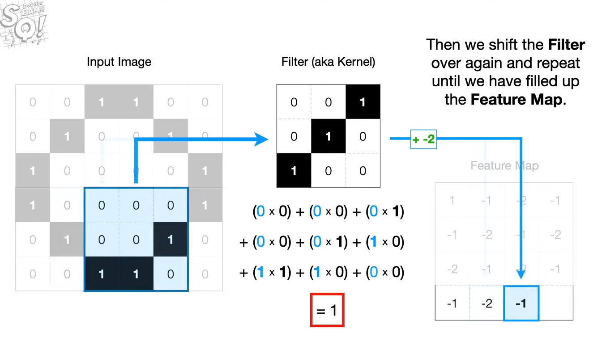
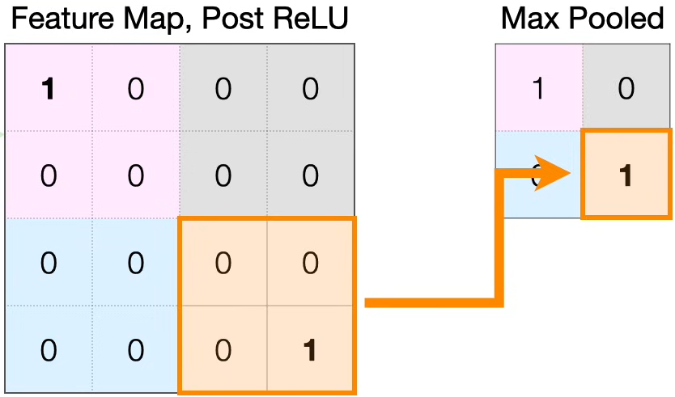
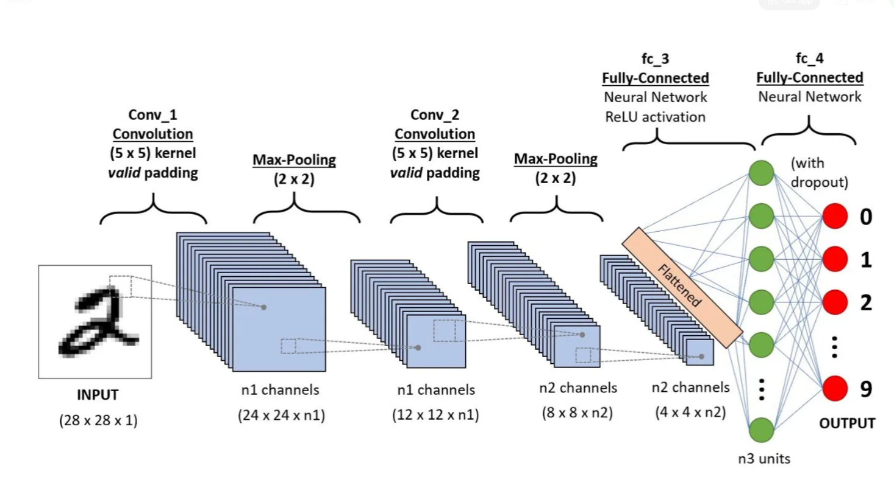
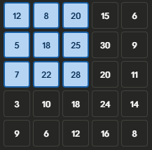
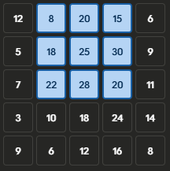
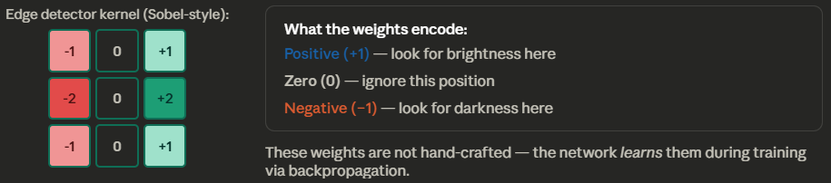
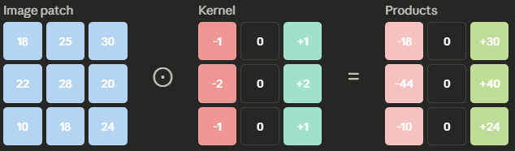
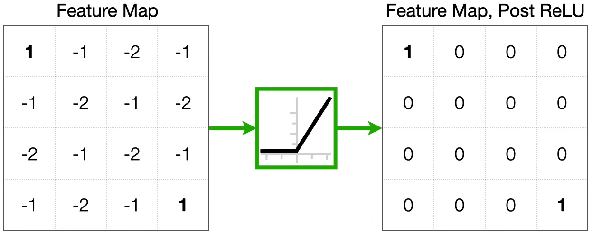
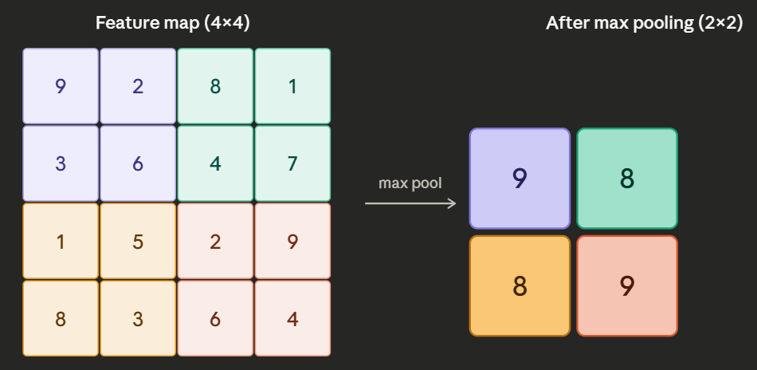

# Convolutional Neural Network From Scratch (Pneumonia)

## 1. Introduction
This project focuses on building a Convolutional Neural Network (CNN) framework from scratch using only Python and NumPy. While standard neural networks are good for simple tasks, they struggle with images because they treat every pixel as an independent piece of data. This project aims to show how a CNN preserves the spatial structure of an image, showing how it understands how pixels relate to their neighbors and how it identify patterns like pneumonia in chest X-rays.

By building the system manually without libraries like TensorFlow or PyTorch, the project highlights the actual math behind how a computer "sees." Instead of relying on pre-built functions, every step from the sliding window of a convolution to the way error signals travel backward is coded from scratch. This approach ensures a complete understanding of the learning process rather than just treating the model as a black box.

### 1.1 Moving from Pixels to Patterns
In a basic neural network, images are flattened into a single line of numbers, which destroys the "shape" of the data. A CNN is designed specifically to handle 2D data by using filters. The main ideas behind this architecture include:

* **Local Receptive Fields:** Each part of the network only focuses on a small section of the image at a time, similar to how a human eye scans a page.

* **Weight Sharing:** The same filter is used across the entire image to look for specific features. This makes the model much more efficient and easier to train on a CPU.

* **Spatial Awareness:** The network can recognize a feature (like a specific lung texture) regardless of where it appears in the frame.

### 1.2 Medical Application: Pneumonia Detection
Medical images are often noisy and the differences between "Normal" and "Pneumonia" can be very subtle. A key part of this project is not just getting a high accuracy score, but making sure the network is reliable. In a medical setting, missing a sick patient is a much bigger error than a false alarm. Therefore, the project explores how to adjust the training process to prioritize finding every positive case.

## 2. System Architecture
A Convolutional Neural Network (CNN) is structured as a series of specialized layers that process data in a "spatial" way. Unlike standard networks that see an image as a flat list, a CNN treats it as a 3D volume with height, width, and depth. The architecture is designed to act as a funnel, taking a high-resolution input and gradually condensing it into high-level features that represent the objects or patterns within the image.

### 2.1 Input and Initial Processing
The architecture begins with the Input Layer, which stores the raw pixel data. In a CNN, this is usually represented as a 3D tensor where the dimensions correspond to the height, width, and the number of color channels (such as 1 for grayscale or 3 for RGB). Because the network needs to maintain the geometric relationship between pixels, this layer does not flatten the data. Instead, it preserves the grid structure so that the following layers can look for patterns in specific areas of the image.

### 2.2 Feature Extraction through Convolutional Layers
The Convolutional Layer is the primary engine of the network. It uses a set of learnable filters, also known as kernels, which are small matrices that slide across the input data. At every position, the filter performs a mathematical operation to see how well its own pattern matches the pixels in that specific spot. This process, illustrated in Fig. 1, allows the network to create "feature maps" that highlight where certain shapes, like edges or textures, are located. Because the same filter is used for the entire image, the network can recognize a pattern no matter where it appears, which makes it much more efficient than a standard fully connected layer.

    
    
<strong>Fig. 1.</strong> Sliding window (kernel) convolution operation and feature map generation. [1]

### 2.3 Dimensionality Reduction via Pooling
To prevent the network from becoming too computationally heavy and to make it more reliable, Pooling Layers are placed between convolutional stages. These layers serve to "downsample" the feature maps, effectively shrinking the height and width of the data. Max-Pooling is the most common version, where the layer looks at a small window of pixels and only passes the highest value to the next stage, as demonstrated in Fig. 2. This ignores the exact location of a feature in favor of its general presence, which helps the network handle images where the subject might be slightly tilted or shifted.

    
    
<strong>Fig. 2.</strong> Max-pooling operation reducing the spatial resolution of a feature map by selecting maximum local values [1].

### 2.4 The Fully Connected Head and Classification
Once the convolutional and pooling layers have extracted the most important visual information, the data must be converted into a format that can be used for a final decision. The 3D feature maps are "flattened" into a 1D vector and passed into a Fully Connected Layer. This part of the network acts like a standard classifier, looking at the entire collection of detected features to determine which category the image belongs to. In a binary system, a single output neuron with an activation function like Sigmoid is used to calculate the final probability of the target class.

    
    
<strong>Fig. 3.</strong> Complete CNN architecture showing the transition from 3D feature maps to a flattened 1D vector for classification. [2]

## 3. Forward Propagation
Forward propagation is the mathematical process where input data travels through the network to generate a prediction. In a Convolutional Neural Network, this involves moving from a high-resolution raw image to a set of abstract features, and finally to a probability. Instead of processing the entire image at once, the forward pass breaks the image down into local patterns, applying linear transformations and non-linear activations at each stage. This sequential flow ensures that the model can build a complex understanding of the chest X-ray, starting with simple edges and ending with diagnostic indicators.

### 3.1 The Convolutional Operation and Feature Extraction
The core of the forward pass begins with the convolutional operation. As a filter slides across the input image, it performs a element-wise multiplication and summation, also known technically as a cross-correlation. For each position $(i, j)$ in the output map, the operation is calculated as:

$$z_{i,j} = \sum_{m} \sum_{n} I_{i+m, j+n} \cdot K_{m,n} + b$$

To understand how the computer actually processes the image, the terms can be broken down as follows:

1. **The Moving Window ($I_{i+m, j+n}$):** Imagine a $3 \times 3$ square sliding over a $200 \times 200$ image. The $(i, j)$ is the current location of the square. The $(m, n)$ iterates through the 9 pixels inside that square.

<table align="center">
  <tr>
    <td align="center">
       
      
<b>Fig. 4.</b> Moving window when i = 0, j = 0.

    </td>
    <td align="center">
       
      
<b>Fig. 5.</b> Moving window when i = 0, j = 1.

    </td>
  </tr>
</table>

2. **The Weighting ($K_{m,n}$):** Every pixel in that $3 \times 3$ window is multiplied by a "weight." If the weights are set to find edges, the math will produce a high number only if an edge is present. This is the core of how the AI "recognizes" things.

    
    
<strong>Fig. 6.</strong> Sobel edge-detector kernel: positive weights detect brightness, negative weights detect darkness, zeros are ignored.

    
    
<strong>Fig. 7.</strong> Element wise multiplication.

3. **Feature Summation ($\sum \sum$):** The nine individual products from the element-wise multiplication are summed into a single scalar value. This "squashing" process reduces the $3 \times 3$ local neighborhood into a single numerical representation, indicating the presence or intensity of a specific visual feature (such as an edge or texture) at that spatial location.

4. **The Bias ($b$):** We add a small constant. Think of this as the "Threshold of Concern." If the sum is slightly positive but not enough to be pneumonia, a negative bias can "zero it out."

### 3.2 Non-Linearity through ReLU
Once the feature maps are generated, they are passed through a Rectified Linear Unit (ReLU) activation function. The primary purpose of this step is to introduce non-linearity, which allows the network to learn relationships that aren't just simple linear combinations of pixels. The ReLU function is defined as $f(z) = \max(0, z)$, meaning it allows positive signals to pass through unchanged while effectively "turning off" any negative values. This helps the network focus on the most relevant features and prevents the mathematical instability that can occur in deeper networks.

    
    
<strong>Fig. 8.</strong> Feature map passing through ReLU activation function.

### 3.3 Spatial Downsampling with Max Pooling
Following activation, the feature maps undergo Max Pooling to reduce their spatial dimensions. The network slides a $2 \times 2$ window across the feature map and selects only the maximum value within that window to move forward to the next layer. This operation is critical for maintaining "translation invariance," which means the network can still recognize a pattern even if it is shifted slightly in the image. Furthermore, by shrinking the height and width of the data by half, the pooling step significantly reduces the computational load for the subsequent layers without losing the most prominent features.

    
    
<strong>Fig. 9.</strong> Max pooling: each 2×2 region collapses to its single highest value, halving the map size.

### 3.4 Flattening and the Sigmoid Prediction
The final stage of the forward pass involves converting the 3D feature volumes into a 1D vector through a process called flattening. This vector is then passed to a single output neuron in a fully connected layer. To convert the raw signal into a usable diagnosis, the network applies the Sigmoid activation function:

$$\sigma(z) = \frac{1}{1 + e^{-z}}$$

This function maps any input value into a strict range between 0 and 1, which represents the probability of the presence of pneumonia. A value closer to 1 indicate the network is confident in a positive diagnosis, while a value closer to 0 indicates a healthy scan.

## 4. Loss Function
The loss function is the mathematical tool the network uses to measure the gap between its predictions and the actual truth. It provides a single scalar value that represents the total error of the model for a given set of images. The objective of the entire training process is to minimize this number through optimization. In a classification task like pneumonia detection, the loss function does not just look at whether the network was right or wrong, but also evaluates how confident it was in its answer, punishing confident but incorrect predictions more severely.

### 4.1 Binary Cross-Entropy (BCE)
For binary classification, the network utilizes the Binary Cross-Entropy loss function. This function is specifically designed to work with the Sigmoid output from the final layer, which provides a probability between 0 and 1. The BCE function compares this probability to the actual label, where 0 represents a healthy scan and 1 represents a pneumonia scan. If the network predicts a high probability for a positive case and the label is actually positive, the loss is low. However, if the network is very confident about the wrong answer—for example, predicting a $0.99$ probability for pneumonia when the patient is actually healthy—the BCE function produces an extremely high loss value. This high error signal is what triggers significant adjustments to the weights during backpropagation.The mathematical formula for the loss is calculated as:

$$
L = -[y \log(\hat{y}) + (1 - y) \log(1 - \hat{y})]
$$

* $y$ (The True Label): This is the ground truth, which is either 0 or 1.
* $\hat{y}$ (The Prediction): This is the probability output by the Sigmoid function.
* $\log(\hat{y})$: The logarithm ensures that as the prediction gets further from the truth, the loss increases exponentially.

To understand why the formula looks like $L = -[y \log(\hat{y}) + (1 - y) \log(1 - \hat{y})]$, we have to look at the two possible scenarios for a patient:

* **Scenario 1: The Positive Case ($y = 1$):**  
When the chest X-ray contains pneumonia, the second term $(1 - y)$ becomes zero. This effectively "mutes" the healthy part of the equation, leaving only $L = -\log(\hat{y})$. The network is now solely focused on how close the prediction $\hat{y}$ is to $1$.

* **Scenario 2: The Negative Case ($y = 0$):**  
When the scan is healthy, the first term $y$ becomes zero. This mutes the pneumonia part of the equation, leaving $L = -\log(1 - \hat{y})$. The network now only evaluates how close the prediction is to $0$.

### 4.2 Handling Class Imbalance and Medical Priority
A significant challenge in medical imaging is that datasets are often imbalanced, frequently containing far more healthy scans than pneumonia scans. If the loss function treats every error the same, the model might learn to simply guess "healthy" every time to keep the total error low, which is dangerous in a clinical setting. To prevent this, a weighted version of the loss function can be implemented. By adding a penalty multiplier to the pneumonia class, the network is punished more for a False Negative (missing a sick patient) than for a False Positive (a false alarm).

The standard BCE formula is modified by introducing a weight factor, $w_{pos}$, to the positive $(y=1)$ term:

$$
L = -[w_{pos} \cdot y \log(\hat{y}) + (1 - y) \log(1 - \hat{y})]
$$

In a hospital, a "False Alarm" results in an unnecessary follow-up test, but a "Missed Case" results in a patient sent home without treatment. If we set $w_{pos} = 5$, the "pain" or error signal sent to the network is five times stronger when it fails to identify a pneumonia scan. This forces the optimization process to prioritize the minority class, ensuring the model's "knowledge" is biased toward safety and detection.

## 5. Backpropagation
Backpropagation is the process where the network learns from the error calculated by the loss function. It works by traveling backward from the output layer to the input image, using the chain rule to determine how much each individual weight and filter contributed to the final error. In a CNN, this is more complex than a standard network because the error has to be "un-pooled" and "un-convolved" to reach the earlier layers. By calculating these gradients, the network knows exactly how to nudge each parameter to perform better on the next scan.

### 5.1 The Chain Rule and Gradient Flow
To calculate how a specific weight ($w$) should be adjusted, the network uses the Chain Rule. This mathematical principle allows us to break down a complex relationship into a series of smaller, local "links." For a weight in the dense layer, the gradient is:

$$
\frac{\partial L}{\partial w} = \frac{\partial L}{\partial \hat{y}} \cdot \frac{\partial \hat{y}}{\partial z} \cdot \frac{\partial z}{\partial w}
$$

If we treat these derivatives like fractions, the intermediate terms ($\partial \hat{y}$ and $\partial z$) effectively cancel out, leaving us with the direct relationship between the Loss and the Weight ($\frac{\partial L}{\partial w}$). In practical terms, this means:

* **The Error Signal:** $\frac{\partial L}{\partial \hat{y}}$ tells us the direction of the mistake.
* **The Activation Slope:** $\frac{\partial \hat{y}}{\partial z}$ (the Sigmoid derivative) tells us how sensitive the output was to the input at that moment.
* **The Input Contribution:** $\frac{\partial z}{\partial w}$ is the actual value of the pixel or neuron that passed through the weight.

### 5.2 Backpropagating through Pooling: The "Winner" Mask
When the error signal reaches a Max Pooling layer, it encounters a unique challenge: pooling layers do not have weights. Their only job during the forward pass was to "pick the highest number" from a local window. Because there are no weights to adjust, the layer’s role in backpropagation is to act as a router for the error signal.

During the forward pass, the network creates a mask, which is a temporary record that remembers the coordinates of the "winning" pixel in each $2 \times 2$ window. When the error signal travels backward, it only flows to the pixel that actually made it through the pooling stage. Since the other three pixels in the $2 \times 2$ window were discarded, they had zero impact on the final prediction, and therefore they receive zero gradient for the error. The gradient of the loss with respect to the input of the pooling layer ($I$) is defined by the following piecewise function:

$$
\frac{\partial L}{\partial I} = \begin{cases} \frac{\partial L}{\partial O} & \text{if } I = \text{max}(window) \\ 0 & \text{otherwise} \end{cases}
$$

Where:  
* $\frac{\partial L}{\partial O}$: The incoming error signal from the next layer (the output of the pooling).
* $I$: The individual pixel in the original feature map.
* $\text{max}(window)$: The specific pixel that was selected as the maximum during the forward pass.

This routing ensures that only the features that actually influenced the network's decision are adjusted, while irrelevant pixels are ignored and their gradient is "masked" out.

### 5.3 Convolutional Gradients (Updating the Kernels)
To find the gradient for a kernel ($K$), the network performs a new convolution-like operation. It takes the error signal (gradient) from the next layer and slides it across the original input image. This calculation reveals which parts of the $3 \times 3$ filter were responsible for the mistake.The gradient for the kernel is calculated as:

$$
\frac{\partial L}{\partial K} = \sum \sum \frac{\partial L}{\partial Z} \cdot I
$$

If a specific weight in a filter consistently leads to a high loss when scanning a pneumonia patch, the gradient will be large, and the weight will be shifted significantly during the optimization step.

### 5.4 Passing Error to Previous Layers
After the kernels are updated, the error signal must continue traveling backward to any earlier convolutional layers. This is done by taking the current error ($\frac{\partial L}{\partial Z}$) and convolving it with a flipped version of the kernel. This "full convolution" effectively redistributes the error back onto the original input dimensions. By the time this process is finished, every weight in every filter has a calculated gradient, allowing the model to update its entire "visual system" before the next training iteration begins.

## References
[1] J. Starmer, "Neural Networks Part 8: Image Classification with Convolutional Neural Networks (CNNs)," YouTube, Jan. 14, 2020. [Online]. Available: https://www.youtube.com/watch?v=HGwBXDKFk9I.

[2] Dharmaraj, "Convolutional Neural Networks (CNN) — Architecture Explained," Medium, [Online]. Available: https://owl.purdue.edu/owl/general_writing/grammar/using_articles.html.